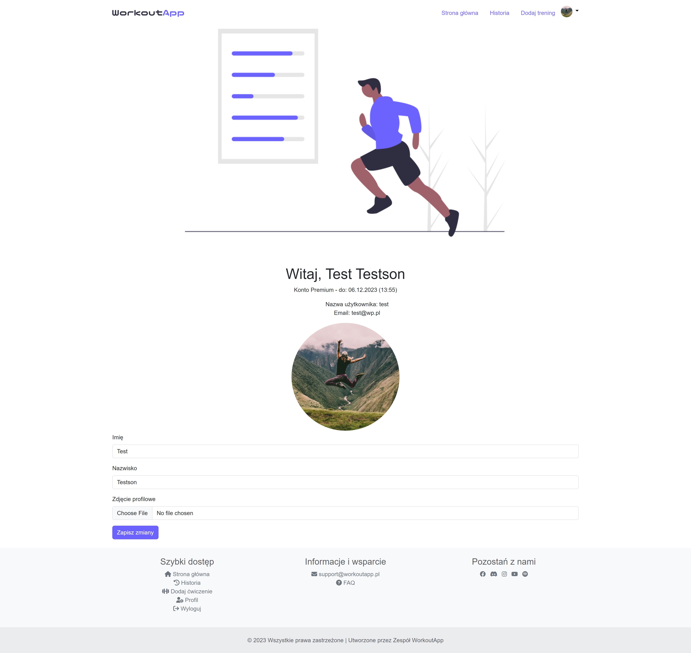
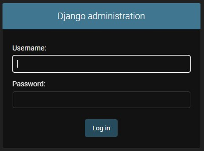
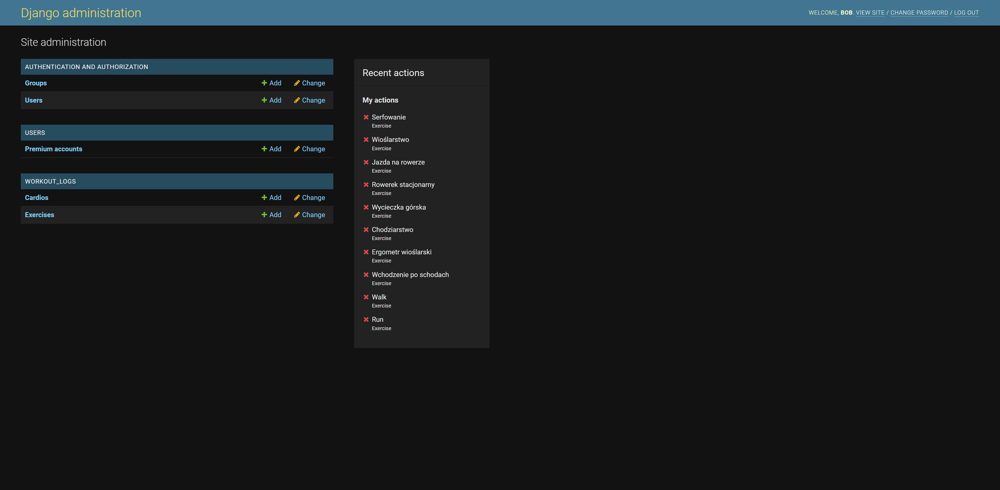

# WorkoutApp - Web application to record your workouts data

👨‍🎓💻Project to get Bachelor of Engineering title

## Description

The WorkoutApp web application is designed to help users record and manage their cardio workouts, such as running and bike riding. Users have the ability to perform CRUD operations on their workout data, including adding, editing, and deleting workouts. The application provides features for filtering, searching, and personalizing user profiles.

## Project Structure

Organization of project, including main directories and their purposes.

### Directory Structure:

```
workout_app
├───payments
│   └───migrations
├───static
│   ├───css
│   ├───images
│   │   └───profile_pictures
│   └───js
├───users
│   ├───migrations
│   └───templates
│       └───users
├───workout_app
└───workout_logs
    ├───management
    │   └───commands
    ├───migrations
    └───templates
        └───workout_logs
```

- `payments`: for manageing payments in app
- `static`: for containing files like styles (css), or scripts (java script) or images
- `users`: for manageing users and autentification
- `workout_app`: main project directory with project settings
- `workout_logs`: for add, view, edit and delete workouts

### Database structure


## Installation

### Prerequisites

List any prerequisites or dependencies needed to run the project, such as Python version, Django version, and other libraries.

### Installation and Usage

Create and activate virtual enviroment

```
python -m venv venv
venv\Scripts\activate.bat
```

### Running the Development Server

Install the required dependencies using

```
pip install -r requirements.txt
```

Run migrations with

```
python manage.py migrate
```

Start the development server with

```
python manage.py runserver
```

The application is accessible at [http://localhost:8000/](http://localhost:8000/)

Accessing the Admin Panel is accessible at [http://localhost:8000/admin/](http://localhost:8000/admin/)

## Using AWS Server

AWS instances


AWS seciurity rules


AWS EC2 instance run


AWS public host access


## Additional Informations

### Features

1. Workouts Management
   - `Create` Users can add new workouts by specifying the date, duration time, distance, and additional notes.
     Workouts can be categorized based on different types of cardio exercises.
   - `Read` Users can view a list of all recorded workouts, including details like date, duration, distance, and notes. Filter workouts by type of training or view all data.
   - `Update`
     Edit existing workouts to update information such as date, duration, distance, or notes.
   - `Delete` Remove workouts from the log when no longer needed.
2. Filtering and Searching
   Users can filter workouts based on various criteria, such as type of training. Search functionality allows users to find specific workouts by name or note.
3. User Profile Personalization
   Users can personalize their profiles by providing a name, last name, and profile picture.
   Profile pictures are automatically resized and cropped to save server data.
4. Premium Animation Feature
   Users have the option to purchase a premium feature that adds animation to their profile picture.
   Premium feature subscription lasts for 30 days and is processed using PayPal (sandbox for now).
5. User Authentication
   Users can register and log in to the system to perform actions on their personal profiles.
   Admin authentication allows access to the admin panel with additional privileges.
6. Admin Panel
   Accessible at the specific address (`/admin`) with admin credentials.
   Admins can view and manage all workouts data for all users.
   Create new admin accounts with specific privileges.

### Technologies Used

- `Python`: Backend programming language.
- `Django`: Web framework for backend development.
- `Django ORM`: Object-Relational Mapping for database interactions.
- `HTML`, `Bootstrap`, `CSS`, `JavaScript`, `Font Awersome`: Frontend development.
- `PayPal API`: Integration for premium feature subscription.
- `AWS`: provides on-demand cloud computing platforms and APIs

### User Interface App preview





### Admin Panel App preview




### Notes

- Static files like css, js or images are loaded from static folder.
- Repetitive elements on website are containing in single file and loaded when needed.
- Password are securly storage in database using PBKDF2 (Password-Based Key Derivation Function 2) with SHA-256. When user create own password there is created salt that is connected to the password nad whole password with salt are hashed with many iterations. So when 2 or more users would have the same password there weren't the same hashes.
- Cross-Site Request Forgery (CSRF) using each time unique token and pass it to the form and then checking if in the header is the same token or not.
- Crop (to square) and change resolution (to lower) of profile images when added, to use server storage more efficient
- Handling PayPal payments using API.
- Set up for CI/CD (Continous Integration/Continous Development) for future test automation using for example Selenium.
- Load automatic fake data on develop server using Faker.
- Deploy app on AWS EC2 to make app public and also enable to monitor app los.
